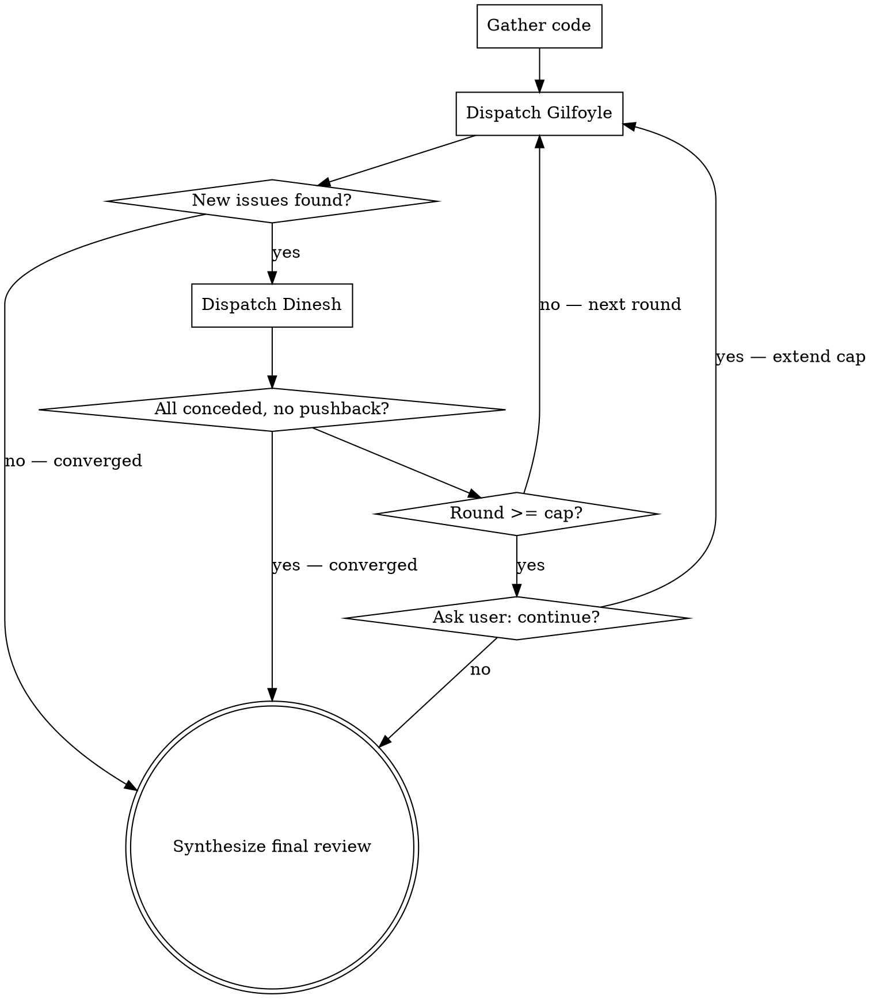

# Dinesh vs Gilfoyle Code Review

Two-agent adversarial code review inspired by HBO's Silicon Valley. Gilfoyle attacks the code with withering technical precision. Dinesh defends it with flustered competence. The banter entertains; the back-and-forth produces genuinely better reviews.

## Invocation

- `/dg` — review git diff (staged + unstaged)
- `/dg 3` — git diff, max 3 rounds
- `/dg src/auth.ts` — review specific file
- `/dg src/auth.ts 3` — specific file, 3 rounds max

## Parse Arguments

1. No args → target = git diff, cap = 5
2. Number only → target = git diff, cap = that number
3. Path only → target = that path, cap = 5
4. Path + number → target = path, cap = number

## Orchestration

### Step 1: Gather Code

**If git diff:**
```bash
git diff HEAD
git diff --staged
```
Combine both diffs. If both are empty, tell the user there's nothing to review.

**If file/path:**
Read the target file(s). If path is a directory, read all source files in it.

**Always: Gather dependency context.**
Look for dependency files in the project root and include them in the context sent to agents:
- `package.json`, `package-lock.json`, `yarn.lock`, `pnpm-lock.yaml` (Node.js)
- `requirements.txt`, `pyproject.toml`, `Pipfile.lock` (Python)
- `go.mod`, `go.sum` (Go)
- `pom.xml`, `build.gradle` (Java)
- `Gemfile`, `Gemfile.lock` (Ruby)
- `Cargo.toml`, `Cargo.lock` (Rust)
- `composer.json`, `composer.lock` (PHP)

These are needed for Gilfoyle's dependency vulnerability scan.

### Step 2: Run the Debate

Initialize: `round = 0`, `debate_history = []`



**Each round:**

1. **Dispatch Gilfoyle agent** (Agent tool, general-purpose) with:
   - Full content of `gilfoyle-agent.md` from this skill's directory
   - The code under review
   - Full debate history
   - Round number
   - Instruction: "You are doing research only — read the code and produce your review. Do NOT edit any files."

2. **Display Gilfoyle's banter** to the user.

3. **Check convergence:** Parse Gilfoyle's FINDINGS section. If all findings are repeats from previous rounds → converge.

4. **Dispatch Dinesh agent** (Agent tool, general-purpose) with:
   - Full content of `dinesh-agent.md` from this skill's directory
   - The code under review
   - Gilfoyle's latest full response
   - Full debate history
   - Round number
   - Instruction: "You are doing research only — read the code and produce your defense. Do NOT edit any files."

5. **Display Dinesh's banter** to the user.

6. **Check convergence:** Parse Dinesh's FINDINGS section. If every point is `[concede]` with zero `[defend]` or `[dismiss]` → converge.

7. **Append both responses to debate_history**, increment round.

8. **If round >= cap:** Ask user: *"These two could go all night. Continue for more rounds? (y/N)"*
   - Yes → extend cap by original amount, continue loop
   - No → proceed to synthesis

**Convergence announcements** (pick one that fits):
- "Gilfoyle has run out of things to hate. Unprecedented."
- "Dinesh has conceded defeat. As expected."
- "These two are going in circles. Separating them before it gets physical."

### Step 3: Synthesize Final Review

After the debate ends, produce a structured summary from the full debate transcript.

**Display format:**

```markdown
## Dinesh vs Gilfoyle Review — [target]
### [N] rounds of mass destruction

---
### Best of the Banter
[2-4 of the funniest or most insightful exchanges from the debate]

---

### Verdict

#### Critical (Gilfoyle won, Dinesh conceded)
[Issues where Dinesh couldn't mount a defense — these are real and need fixing]
- `file:line` — issue — fix

#### Important (Gilfoyle won after debate)
[Issues Dinesh tried to defend but Gilfoyle's argument was stronger]
- `file:line` — issue — fix

#### Contested (Dinesh held his ground)
[Issues where Dinesh's defense was valid — code is likely fine]
- `file:line` — what was raised — why the defense holds

#### Dismissed (Gilfoyle was nitpicking)
[Issues both sides agree don't matter]
- `file:line` — what was raised — why it's a non-issue

### Strengths
[Things even Gilfoyle grudgingly acknowledged were good]

### Score
Gilfoyle: X | Dinesh: Y
[Tongue-in-cheek tally of who won more arguments]

### Recommended Changes
[Clean checklist — no banter, no context, just what to do]
- [ ] `file:line` — what to change
- [ ] `file:line` — what to change
- [ ] ...

If no changes needed: "Nothing to fix. Gilfoyle is furious."
```

### Step 4: Offer Comic Strip

After displaying the final review, ask the user:

> *"Want a comic strip of the best moments? (y/N/pr)"*
>
> - **y** — generate and open in browser
> - **pr** — generate, convert to PNG, and attach to the current PR as a comment
> - **N** — skip

If `y` or `pr`, generate an HTML comic strip:

1. Read the comic template from `comic-template.html` in this skill's directory.
2. Fill in the template placeholders:
   - `{{REVIEW_TARGET}}` — the target reviewed (e.g., "UI Codebase", "git diff", file path)
   - `{{ROUND_COUNT}}` — number of debate rounds
   - `{{GILFOYLE_SCORE}}` / `{{DINESH_SCORE}}` — final scores
   - `{{DATE}}` — current date
   - `{{PANELS}}` — Generate 4-8 comic panels from the best banter exchanges. Each panel uses this HTML structure:

```html
<!-- Gilfoyle panel -->
<div class="panel gilfoyle">
  <span class="panel-number">1</span>
  <div class="panel-header">
    <div class="avatar"><svg><use href="#gilfoyle-avatar"/></svg></div>
    GILFOYLE
  </div>
  <div class="panel-body">
    <div class="speech">The quote goes here. Use <code>inline code</code> for technical references.</div>
  </div>
</div>

<!-- Dinesh panel -->
<div class="panel dinesh">
  <span class="panel-number">2</span>
  <div class="panel-header">
    <div class="avatar"><svg><use href="#dinesh-avatar"/></svg></div>
    DINESH
  </div>
  <div class="panel-body">
    <div class="speech">The response goes here.</div>
  </div>
</div>

<!-- Full-width panel for dramatic moments -->
<div class="panel gilfoyle full-width">
  <span class="panel-number">3</span>
  <div class="panel-header">
    <div class="avatar"><svg><use href="#gilfoyle-avatar"/></svg></div>
    GILFOYLE
  </div>
  <div class="panel-body">
    <div class="speech">A particularly devastating line that deserves the full width.</div>
  </div>
</div>
```

   - `{{VERDICT_ITEMS}}` — Generate verdict items from the final review:

```html
<div class="verdict-item">
  <span class="tag tag-fixed">FIXED</span> CSP nonce replaced with deploy-time placeholder
</div>
<div class="verdict-item">
  <span class="tag tag-contested">CONTESTED</span> MutationObserver lifetime — Dinesh held ground
</div>
<div class="verdict-item">
  <span class="tag tag-dismissed">DISMISSED</span> prop-types — tree-shakes out
</div>
```

3. **Select the best moments for panels.** Prioritize:
   - The funniest exchanges (back-and-forth pairs work best)
   - Moments where Gilfoyle conceded (rare, dramatic)
   - Dinesh's best zingers
   - The most technically devastating lines
   - Keep quotes concise — trim to 1-3 sentences per speech bubble

4. Write the filled HTML to a timestamped file: `/tmp/dg-comic-{timestamp}.html`

**If `y`:**
5. Open it in the browser: `open /tmp/dg-comic-{timestamp}.html`
6. Tell the user where the file is saved.

**If `pr`:**
5. Convert to PNG using a headless browser:
   ```bash
   # Try puppeteer/chromium first, fall back to wkhtmltoimage, then to Safari
   npx --yes puppeteer-screenshot /tmp/dg-comic-{timestamp}.html /tmp/dg-comic-{timestamp}.png 2>/dev/null \
     || wkhtmltoimage --quality 90 /tmp/dg-comic-{timestamp}.html /tmp/dg-comic-{timestamp}.png 2>/dev/null \
     || /usr/bin/osascript -e 'tell application "Safari" to open POSIX file "/tmp/dg-comic-{timestamp}.html"'
   ```
   If screenshot tools aren't available, tell the user to screenshot manually from the browser.
6. Detect the current PR:
   ```bash
   gh pr view --json number,url --jq '.number'
   ```
7. Upload the image and comment on the PR:
   ```bash
   gh pr comment {PR_NUMBER} --body "$(cat <<'EOF'
   ## /dg Review Comic Strip

   

   _Generated by [/dg](https://github.com/v1r3n/dinesh-gilfoyle)_
   EOF
   )"
   ```
   Note: If `gh pr comment` doesn't support local image upload, upload the image to the PR body as a drag-drop suggestion, or convert to base64 and embed.
8. Tell the user the comment was posted with a link to the PR.

## Key Principles

- **The banter is the feature, not decoration** — it keeps reviews entertaining and thorough
- **Dinesh's concessions are the strongest signal** — when he can't defend, it's a real issue
- **Successful defenses validate code** — if Dinesh can justify it under Gilfoyle's assault, it's solid
- **Always end with actionable summary** — fun on the outside, useful on the inside
- **Be technically correct** — the humor only works if the technical substance is real
